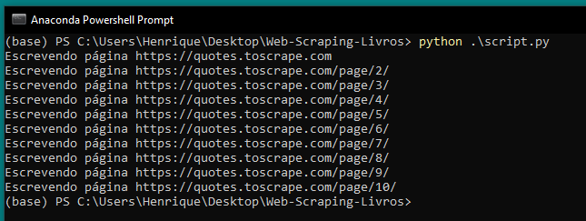
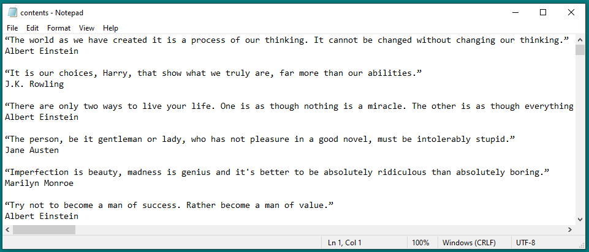

# Web-Scraping-Citações

## Objetivo do projeto
Esse script tem como objetivo coletar as citações presentes no site https://quotes.toscrape.com/ e gerar um arquivo de saída com todas elas. Essas citações podem ter diversas finalidades, como o uso dentro de sites e aplicações de forma estética ou em outros contextos semelhantes.
## Funcionalidade
A linguagem utilizadas foi python3, e as bibliotecas foram a requests e BeautifulSoup.
Inicialmente é feito uma solicitação GET no site https://quotes.toscrape.com/ utilizando a biblioteca requests, sendo retornado uma resposta HTML. Essa resposta é passada para a biblioteca BeautifulSoup para que seja possível acessar e navegar pelos recursos presentes no código HTML.
A verificação mais importante é analisar se existe um botão de "next" na página presente, se existir, é realizado a coleta das citações da página atual, e ao chegar no final das citações da página, a URL é atualizada para a próxima página e é feito uma nova solicitação GET, repetindo o processo.
Dentro do while de verificação do botão, existe um looping "for" interno responsável pela escrita das informações coletadas. Quando utilizado soup.find_all('div', class_='quote'), é retornado uma lista com todos os elementos da página que contenham os elementos div e com a classe CSS 'quote', sendo possível iterar sobre esses elemento, que nesse caso, são as citações.
O segundo looping tem como único objetivo obter e escrever o conteúdo da última página.
## Como executar
Ambas as bibliotecas podem ser instaladas utilizando o pip. Após feito a instalação, basta executar o arquivo script.py diretamente no terminal, e o arquivo de saída vai ser salvo no local onde o arquivo script.py está salvo.
## Prints do projeto
- É mostrado no terminal qual a URL utilizada em cada iteração. Caso aconteça algum erro de obtenção ou escrita, vá manualmente na última url impressa no terminal e verifique se existe alguma citação que possa apresentar conflitos.

- O arquivo de saida é um .txt com a seguinte formatação.

